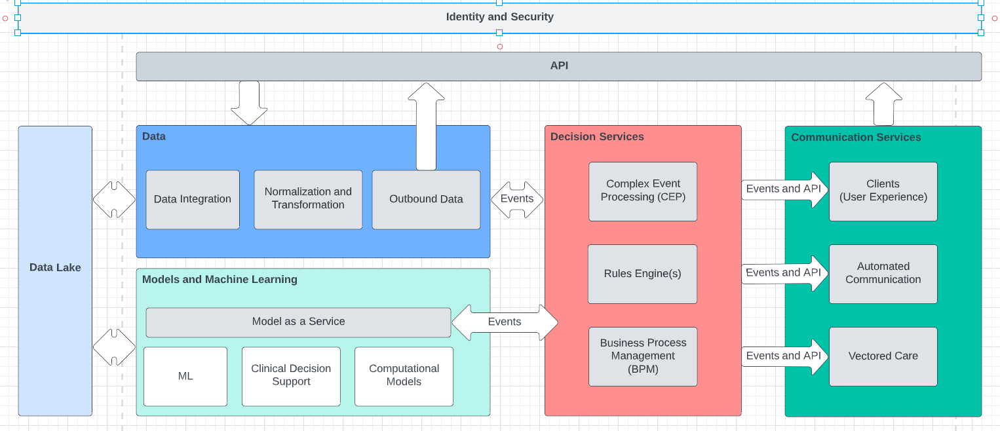

## Admission Intelligence

*  [Introduction](#Introduction)
    *  [The Challenge](#the-challenge)
    *  [Submission Summary](#submission-summary)
*  [Reference Architecture](#Reference-Architecture)
*  [Data Format and Rules](#data-format-and-rules)
*  [Running the Software](#running-the-software)
*  [Future Functionality and Next Steps](#future-functionality-and-next-steps)

### Introduction

Admission Intelligence is a submission to the Future of Healthcare Hackathon. 

#### The Challenge
Preventable hospital admissions cost US healthcare more than $33B annually and it is estimated that more than 15 percent
of all adult inpatient stays with a primary expected payer of Medicare were potentially preventable ([HCUP](https://www.hcup-us.ahrq.gov/reports/statbriefs/sb259-Potentially-Preventable-Hospitalizations-2017.jsp
) and [NIH](https://www.ncbi.nlm.nih.gov/books/NBK559945/)). Studies indicate that the preventable admission 
problem disproportionately impacts disadvantaged communities and individuals, especially individuals at an economic disadvantage.

A one size fits all approach won't work. The scope of the challenge means improving preventable admission rates requires a data driven architecture
that can operate at scale and bring the best decision making and automation tools available to life. 

Under the following guiding requirements:

* __Targeted Care__
    * Enhance and empower the experts. Enable clinicians and subject matter experts to target care and attention to the patients most at risk of admission
    * Personalized automation. Automated communication to patients must meet them where they are in life and connectivity. The system must be adaptable to a wide range of circumstances.

* __Modern Architecture and Infrastructure__
    * Utilize modern software infrastructure to provide automated communication, feedback, and outcome tracking across a broad population
    * Build for scale. The problem is huge and requires massive amounts of data and decision making

* __Self Improving Systems__
    * Close the loop. The architecture must capture feedback and outcomes to improve models, rules, and alerts
    * Observability is key. Utilize the available data to track outcomes in as close to real time as possible. 
    
* __Data and Models at the Core__
    * Bring models to life. The architecture must enable new models and machine learning techniques must be brought 
    * Adapt to the data. Decoupled systems and an event driven architecture allow models to evolve and get to production faster and with bigger impact

#### Hackathon Submission Summary
The submission consists of two parts. 

The first part of the submission is a [reference architecture](#Reference-Architecture) that describes a set of services and technology that 
could support a real world deployment with the scale, automation and software based decision making required to make a meaningful impact on 
preventable admissions in US health care.

The second part of the submission is a proof of concept implementation of the [decision services](#decision-services) and dashboard systems of
the architecture. The code for the submission is available on the [admission-intelligence github page](https://github.com/admission-intelligence) and
the [dashboard can be viewed here](TODO - deploy the thing) 

### Reference Architecture

The reference architecture in the submission serves as a technical roadmap to achieve the objective of reducing the rate of preventable admissions. 

The architecture has four key domains

- __Data Management__
    - Responsible for ingestion of data sources to drive model and decision services
    - Expose APIs and data processing capabiltiy for relevant healthcare data including
        - Claims and remittance (837/835 edi)
        - Eligibility data (270/271 edi)
        - EMR data via HL7
        
- __Models as Service__
    - A principle challenge with modern model development is turning the outputs of the models into actionable outcomes. The model as a service element of the architecture provides
    the rest of the architecture a standardized view of model inputs and outputs. The outputs 
- __Decision Services__
- __Communication Services__

#### Model as a Service

- standardization
- feature store

#### Data Lake

The data lake in the architecture provides storage for both structured and unstructured data. 

#### Infrastructure, Messaging, and Standards

The gray boxes in the architecture diagram above are intended to be microservices

- Kafka as a messaging tier
    - Interaction between domains must be event driven and be as decoupled as possible. The four domains will 
- Kubernetes
    The services will be deployed to a Kubernetes cluster to support automated scaling and operation at the scale required to process the multitude of data sources needed to drive the models and business rules
    
- Kafka
- Microservices
- Decoupled domains

#### Decision Services

#### Dashboards and User Experience

### Technology Survey

#### Data Management
 - (Datavant Switchboard)[https://datavant.com/product/]
 - (AWS Comprehend Medical)[https://aws.amazon.com/comprehend/medical/]
    - Note: Comprehend is focused on NLP for unstructured medical data and could be used in concert with other data platforms
 
#### Data Lake

- (Databricks Delta Lake)[https://www.databricks.com/discover/data-lakes/introduction]
- (Snowflake)[https://www.snowflake.com/en/data-cloud/workloads/data-lake/]
- (Cloudera)[https://www.cloudera.com/products/sdx/data-lake-service.html]
- (Azure Data Lake)[https://azure.microsoft.com/en-us/solutions/data-lake/]
- (Data Lake on AWS)[https://aws.amazon.com/solutions/implementations/data-lake-solution/]
    - Note that the AWS data lake solution is a conglomeration of other AWS technologies driven by DynamoDB an S3 for storage. 

#### Kubernetes

- (GKE)[https://cloud.google.com/kubernetes-engine]
- (AKS)[https://azure.microsoft.com/en-us/services/kubernetes-service/]
- (EKS)[https://aws.amazon.com/eks/]
- (OpenShift)[https://www.redhat.com/en/technologies/cloud-computing/openshift]
- (Tanzu)[https://tanzu.vmware.com/tanzu]

#### Service Development

- (Quarkus)[https://quarkus.io/]
- (SpringBoot)[https://spring.io/projects/spring-boot/]
- (FastAPI (python))[https://fastapi.tiangolo.com/]

#### Messaging

- (Azure Kafka on HDInsight)[https://docs.microsoft.com/en-us/azure/hdinsight/kafka/apache-kafka-introduction]
- (MSK on AWS)

#### Identity and Security

All of the cloud providers provide identity solutions. In addition there are ope
- (Okta Customer Identity)[https://www.okta.com/solutions/secure-ciam/]
- (Keycloak.X) [https://www.keycloak.org/2021/10/keycloak-x-update]
    - An open source cloud native identity solution that can be used to provide security and identity, particularly in Kubernetes based solutions.

#### Model Hosting

- (Azure ML)[https://azure.microsoft.com/en-us/services/machine-learning/]
- (Sagemaker)[https://aws.amazon.com/pm/sagemaker]
- (Databricks ML)[https://www.databricks.com/product/machine-learning]

### Simulating Patient Scenarios

### Future Functionality and Next Steps

- Model development
- Develop model as a service
- Clinical feedback/partnership

### Running the Software

### Additional Resources
