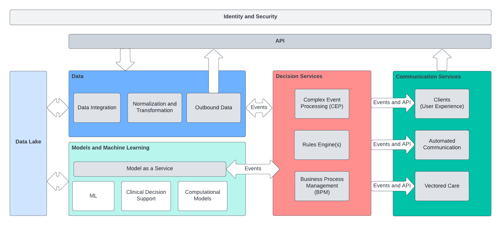

## Admission Intelligence

*  [Introduction](#Introduction)
    *  [The Challenge](#the-challenge)
    *  [Submission Summary](#submission-summary)
*  [Reference Architecture](#Reference-Architecture)
*  [Data Format and Rules](#data-format-and-rules)
*  [Running the Software](#running-the-software)
*  [Future Functionality and Next Steps](#future-functionality-and-next-steps)

### Introduction

Admission Intelligence is a submission to the Future of Healthcare Hackathon. 

#### The Challenge
Preventable hospital admissions cost US healthcare more than $33B annually and it is estimated that more than 15 percent
of all adult inpatient stays with a primary expected payer of Medicare were potentially preventable ([HCUP](https://www.hcup-us.ahrq.gov/reports/statbriefs/sb259-Potentially-Preventable-Hospitalizations-2017.jsp
) and [NIH](https://www.ncbi.nlm.nih.gov/books/NBK559945/)). Studies indicate that the preventable admission 
problem disproportionately impacts disadvantaged communities and individuals, especially individuals at an economic disadvantage.

A one size fits all approach won't work. The scope of the challenge means improving preventable admission rates requires a data driven architecture
that can operate at scale and bring the best decision making and automation tools available to life. 

Under the following guiding requirements:

* __Targeted Care__
    * Enhance and empower the experts. Enable clinicians and subject matter experts to target care and attention to the patients most at risk of admission
    * Personalized automation. Automated communication to patients must meet them where they are in life and connectivity. The system must be adaptable to a wide range of circumstances.

* __Modern Architecture and Infrastructure__
    * Utilize modern software infrastructure to provide automated communication, feedback, and outcome tracking across a broad population
    * Build for scale. The problem is huge and requires massive amounts of data and decision making

* __Self Improving Systems__
    * Close the loop. The architecture must capture feedback and outcomes to improve models, rules, and alerts
    * Observability is key. Utilize the available data to track outcomes in as close to real time as possible. 
    
* __Data and Models at the Core__
    * Bring models to life. The architecture must enable new models and machine learning techniques must be brought 
    * Adapt to the data. Decoupled systems and an event driven architecture allow models to evolve and get to production faster and with bigger impact

#### Hackathon Submission
The submission consists of two parts. 

The first part of the submission is a [reference architecture](#Reference-Architecture) that describes a set of services and technology that 
could support a real world deployment with the scale, automation and software based decision making required to make a meaningful impact on 
preventable admissions in US health care.

The second part of the submission is a proof of concept implementation of the [decision services](#decision-services) and dashboard systems of
the architecture. The code for the submission is available on the [admission-intelligence github page](https://github.com/admission-intelligence) and
the [dashboard is deployed on Azure and can be viewed here](http://20.106.57.50:8082/) 

### Datasets and Studies Used for Implementation
 
- [COPD Exacerbations and Prevention](https://www.ncbi.nlm.nih.gov/pmc/articles/PMC7134993/)
- [CDC behavioral risk factor datasets](https://www.cdc.gov/brfss/annual_data/annual_2020.html) 
- [Area Deprivation Index (ADI) by geography](https://www.neighborhoodatlas.medicine.wisc.edu/download)
- [Selected Primary Care Access and Quality Measures](https://data.dartmouthatlas.org/primary-care/#longitudinal)

### Reference Architecture

The reference architecture in the submission serves as a technical roadmap to achieve the objective of reducing the rate of preventable admissions. 

The architecture has four key domains

- __Data Management__
    - Responsible for ingestion of data sources to drive model and decision services
    - Expose APIs and data processing capabilty for relevant healthcare data
    - In most implementations this domain of the architecture will be a dedicated data platform that provides normalized access to all available healthcare data
- __Model as a Service__
    - A principle challenge with modern model development is turning the outputs of the models into actionable outcomes. The model as a service element of the architecture provides
    the rest of the architecture a standardized view of model inputs and outputs. The outputs 
- __Decision Services__
    - Rules engines and complex event processors to take in normalized data as well as the outputs from the Models domain
    - Encodes the policy and business rules for the healthcare organization
    - Evaluates patient status and model data and drives communication and alerting to the rest of the architecture
    - Enables the architecture to make decisions and take actions using all available data streams
- __Communication Services__
    - Responsible for interacting with the outside world including publishing events to EMR/EHR implementations at care organizations
    - Consumes events from the decision services domain and generates automated patient communication
    - Provides dedicated UX to interact with the admission intelligence system as a whole

#### Infrastructure, Messaging, and Standards

The gray boxes in the architecture diagram above are intended to be microservices

- Kafka as a messaging tier
    - Interaction between domains must be event driven and be as decoupled as possible
    - The four domains will emit and consume domain events based on schemas that act as contracts between the systems to maintain independence and the ability to evolve
- Kubernetes
    The services will be deployed to a Kubernetes cluster to support automated scaling and operation at the scale required to process the multitude of data sources needed to drive the models and business rules
- Microservices
    - In principle the microservices could be built and delivered via any technology that supports deployment in a container
    - The microservices for the PoC implementation were built using Quarkus which can be built to a high performance native Java image

#### Decision Services

There are three key types of deployment in the decision services domain

- Rules Engine(s)
    - Encode and execute business rules
    - Enable clinical stakeholders to define and deploy logic without engineering overhead
    - In this architecture the rules implementation must be static. See CEP below for evaluation over time
- Complex Event Processing (CEP)
    - Generally an extension of rules engines
    - In this architecture the CEP system is responsible for evaluating events and data trends that occur over time
    - CEP allows the architecture to trigger on changes in trends
    - CEP allows the architecture 
- Business Process Management (BPM)
    - Provides the ability to deploy business processes on top of the outputs from the rules engines and CEP engine. For example, a BPM
    implementation could provide for recurring communication to patients, invoke external systems to capture patient contact information, or 
    enable a workflow on top of the vectored care alerts.

#### Model as a Service

One of the key elements of the architecture is the ability to onboard additional ML models to provide decisions and data
to drive care and patient alerting. The model as a service domain will provide a framework for models to generate results and 
have those results available to the system as a whole.

A realized implementation of the architecture must also provide a mechanism for model invocation via API distinct from the model developer. 
That is, the data scientist will not need to worry about production architecture. The system will onboard the model and make it availble to the 
architecture via API and domain event. 

#### Data Lake

The data lake in the architecture provides storage for both structured and unstructured data. 
    
#### Dashboards and User Experience

In most implementations the expectation would be that events and alerts coming out of the system will be sent to a given care organizations existing systems (EMR etc.). However, the architecture will
expose APIs that can be consumed by a dedicated UI. The PoC implementation is a simple bootstrap dashboard and is not a representative example. A modern application built using Vue, React, or Angular 
would be appropriate.

### Technology Survey

The sections below provide example technologies that could be adopted to achieve the goals of the overall architecture. 
There are many additional options in every space but effort was taken to select technologies that will largely interoperate and that are leaders
in their respective spaces.

#### Health Data Management
 - [Datavant Switchboard](https://datavant.com/product/)
 - [AWS Comprehend Medical](https://aws.amazon.com/comprehend/medical/)
    - Note: Comprehend is focused on NLP for unstructured medical data and could be used in concert with other data platforms
 
#### Data Lake

- [Databricks Delta Lake](https://www.databricks.com/discover/data-lakes/introduction)
    - Note: Not a pure data lake implementation. Makes some assumptions about transformation and data formats
- [Snowflake](https://www.snowflake.com/en/data-cloud/workloads/data-lake/)
- [Cloudera](https://www.cloudera.com/products/sdx/data-lake-service.html)
- [Azure Data Lake](https://azure.microsoft.com/en-us/solutions/data-lake/)
- [Data Lake on AWS](https://aws.amazon.com/solutions/implementations/data-lake-solution/)
    - Note that the AWS data lake solution is a conglomeration of other AWS technologies driven by DynamoDB an S3 for storage. 

#### Kubernetes
All major cloud providers provide managed Kubernetes instances. The selection of a particular technology here will drive the selection
of many of the other platform technologies

- [AKS](https://azure.microsoft.com/en-us/services/kubernetes-service/)
- [GKE](https://cloud.google.com/kubernetes-engine)
- [EKS](https://aws.amazon.com/eks/)
- [OpenShift](https://www.redhat.com/en/technologies/cloud-computing/openshift)
    - Provides some independence from the underlying cloud vendor in cases where portability across infrastructure providers is important
- [Tanzu](https://tanzu.vmware.com/tanzu)
    - Newer entrant to the space

#### Service Development

- [Quarkus](https://quarkus.io/)
    - The services in the PoC implementation use Quarkus.
- [SpringBoot](https://spring.io/projects/spring-boot/)
- [FastAPI (python)](https://fastapi.tiangolo.com/)

#### Messaging

- [Azure Kafka on HDInsight](https://docs.microsoft.com/en-us/azure/hdinsight/kafka/apache-kafka-introduction)
- [MSK on AWS](https://aws.amazon.com/msk/)
- [Confluent Kafka](https://www.confluent.io/apache-kafka-vs-confluent/)
    - Note: The confluent implementation is an extended version of Kafka. Confluent provides extended capability on top of the open source implementation. Some of the functionality and libraries are proprietary to Confluent.

#### Identity and Security

All of the cloud providers provide identity solutions. In addition there are ope
- [Okta Customer Identity](https://www.okta.com/solutions/secure-ciam/)
- [Keycloak.X] (https://www.keycloak.org/2021/10/keycloak-x-update)
    - An open source cloud native identity solution that can be used to provide security and identity, particularly in Kubernetes based solutions.

#### Model Hosting

- [Azure ML](https://azure.microsoft.com/en-us/services/machine-learning/)
- [Sagemaker](https://aws.amazon.com/pm/sagemaker)
- [Databricks ML](https://www.databricks.com/product/machine-learning)

### Future Functionality and Next Steps
The PoC is built to provide an Art of the Possible demo for the architecture. There are numerous opportunities to improve and expand
on the journey to real world implementation.

- Build and deploy models to identify high risk patients in the diabetes and COPD domains
- Work with real clinical partners to create and evaluate rules for deployment in a real world scenario
- Develop model as a service so that additional models can be evaluated and 
- Rebuild the current UI using modern technology
